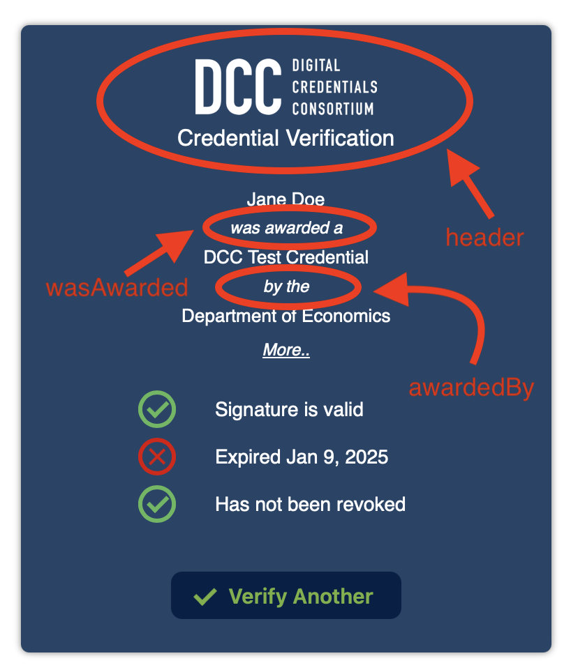

# veri-good

A [Web Component](https://developer.mozilla.org/en-US/docs/Web/API/Web_components) providing entirely in-browser verification of [Verifiable Credentials](https://www.w3.org/TR/vc-data-model-2.0/).

'In-browser' meaning that the credential is not sent to the server. It never leaves the web browser, and so remains entirely private.

Web components are custom HTML tags that work natively with all modern browsers, and can therefore be dropped into any HTML page, like this simple example:

```
<html>
  <body>
    <div> put whatever you want around the veri-good tag, like this div </div>

    <veri-good></veri-good>
    
    <script type="module" src="=bundle.js"></script>

  </body>
</html>
```

You'll need to have saved that bundle.js (which is in the dist directory of this repository) to your server so it 
can be downloaded by the web browser.

If you are using a bundler (webpack, rollup, etc.) install from npm:

`npm i @digitalcredentials/veri-good`

and import somewhere like your main entry file (to ensure it gets imported and run):

`import '@digitalcredentials/veri-good'`

Note that we aren't importing anything that gets assigned to a variable. We simply want the import to pull in the code
and run it, which builds the component and registers it with the web browser.

We also provide a separate package that wraps the web component in a react element:

* [@digitalcredentials/veri-good-react github repo](http://github.com/digitalcredentials/veri-good-react)
* [@digitalcredentials/veri-good-react npm package](https://www.npmjs.com/package/@digitalcredentials/veri-good-react)

### Issuer List

The signing [DID (Decentralized Identifier)](https://w3c.github.io/did/) for each credential is looked up in a list of DIDs that you register with the veri-good component. The lookup confirms that the credential was signed by someone you recognize (like yourself).

> [!IMPORTANT]
> Providing this list is critical. The verifier outright rejects any credentials that aren't in the list.

You can set your issuer list in a template inside the `veri-good` tag like so:

  ```
 <body>
    <veri-good>
        <template id="issuer-dids">
          {
            "did:web:digitalcredentials.github.io:testDID": {
                "issuerName": "Department of Chemistry",
                "url": "https://chemistry.uni.edu"
            },
            "did:key:z6MkjoriXdbyWD25YXTed114F8hdJrLXQ567xxPHAUKxpKkS": {
                "issuerName": "Department of Economics",
                "url": "https://econ.uni.edu"
            }
          }
        </template>
    </veri-good>
    <script type="module" src="=bundle.js"></script>
</body>
 ```

Use the same json structure for your own list.

The issuerName is displayed when verifying a credential issued by that DID.

You can also programmatically set the did list like so:

 ```
 <body>
    <veri-good registry-list="https://digitalcredentials.github.io/dcc-known-registries/known-did-registries.json"></veri-good>
    <script type="module" src="=bundle.js"></script>
    <script>
      const verifier = document.querySelector('veri-good')
        verifier.addEventListener('veri-good-is-ready', (e) => {
          verifier.setIssuerDids(`{
            "did:web:digitalcredentials.github.io:testDID": {
                "issuerName": "Department of Chemistry",
                "url": "https://chemistry.uni.edu"
            }}`)
      });
    </script>
</body>
 ```

Notice that we have to wait for the web component to finish intializing and fire the 'veri-good-is-ready' event before we can call the 'setIssuerDids' method on it.

You can of course also (and more likely) call setIssuerDids in your own javascript that you bundle up with webpack or the like. In other words, you don't have to call 'setIssuerDids' from a script tag in the html.

### Programmatic Verification

You can programmatically set the VC to be verified by calling the 'verify' method on the element, like so:
 
 ```
 <body>
    <veri-good registry-list="https://digitalcredentials.github.io/dcc-known-registries/known-did-registries.json"></veri-good>
    <script type="module" src="=bundle.js"></script>
    <script>
      const verifier = document.querySelector('veri-good')
        verifier.addEventListener('veri-good-is-ready', (e) => {
          verifier.verify("https://digitalcredentials.github.io/vc-test-fixtures/verifiableCredentials/v1/bothSignatureTypes/didKey/legacy-noStatus-noExpiry-basicOBv3.json")
      });
    </script>
</body>
 ```

Notice that we again (as with the setIssuerDids method) have to wait for the web component to finish intializing and fire the 'veri-good-is-ready' event before we can call the 'verify' method on it.

As with the `setIssuerDids` method, you can of course also call `verify` in your own javascript that you bundle up with webpack or the like. 

You might use the 'verify' call for cases like:

* immediately verifying a credential whose url has been passed in as a request parameter on your html page.
* verifying a credential that the end user selects from a list of credentials on the page, like say in a web wallet

### Customization

#### Slots

There are three 'slots' in the web component into which you can place custom html content:

* header
* wasAwarded
* awardedBy

Use them by including your custom content inside the `<veri-good>` tag like so:

```
<veri-good registry-list="https://digitalcredentials.github.io/dcc-known-registries/known-did-registries.json">
    <div slot="header">
        <div style="margin:.2em">University of Wonderful</div>
        <div style="font-size:1.2em">Course Credential Verification</div>
    </div>
    <div slot="wasAwarded">earned</div>
    <div slot="awardedBy">awarded by</div>
</veri-good>
```

Note the `slot=` attributes. They must be specified with the given values (header, wasAwarded, awardedBy), just as they are used above. They can, however, be used with elements other than divs. The web component basically takes an element with a 'slot' attribute and drops that element, including its children, into a matching predefined slot in the veri-good component.

The three slots map into the verifier like so:



You'll of course likely have to play with the css for your slots.

If you don't provide content for the slots, they default to the values show in the screenshot.


